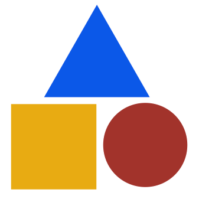

# OpenSchemas map2model



This version of **map2model** is a simplified version of Python module 
derived from the [Bioschemas Groups](http://bioschemas.org/groups/). It will help you
to create an OpenSchema intended for submission to [schemas.org](schemas.org), with
a focus on tech / hpc specifications that might not fall cleanly under strictly 
biological sciences, but support open science.

**map2model** retrieves properties and schema.org (Marginality, Cardinality and Controlled Vocabularies) 
using mapping files (in a specifications folder, see an [example here](https://www.github.com/openschemas/spec-container)) 
then classifies properties into two groups:
1. **Extended properties:** Properties that are part of the extended schema.org Type.
1. **New properties:** Properties that are new to the schema.org vocabulary or are completely new to schema.org.

After classifying the properties, **map2model** generates Markdown file(s) 
that can be interpreted by [openschemas.github.io](https://openschemas.github.io)


> If you want to modify the Flow Chart open the [xml file](docs/img/map2model_workflow.xml) and name it `map2model_workflow.png` in the *doc > img*.

## Contribute a Specification
Do you want to contribute a specification? Your workflow will look like this:

1. Create your specification easily using [Google Sheets](https://docs.google.com/spreadsheets/d/1Ty69GRzc3xuvfpEIRHjfl_9L25MNFfrKXCdwrpxYslo/edit?usp=sharing)
1. Fork the [template repository](https://www.github.com/openschemas/spec-template) and download them to it.
1. Generate the files locally with [schema-builder](https://www.github.com/openschemas/schema-builder) or connect to CircleCI to d this for you.
1. Issue a pull request to [openschemas.github.io](https://www.github.com/openschemas/openschemas.github.io) with your contribution!

We encourage you to maintain your specification (and issues / discussion around it) in its own Git repository,
to ensure modularity and version control of examples and associated documentation. We would be happy to 
create for you an `openschemas/spec-<NAME>` repository here if you want to join the Github organization
and get support from the maintainers within!

## Usage
This usage details native usage! If you want to more easily use map2model, we recommend first the 
[template](https://www.github.com/openschemas/spec-template) and the docker 
[openschemas/schema-builder](https://www.github.com/openschemas/schema-builder) that 
packages map2model and is used by the template.

### Requirements
These instructions are for local usage.

Before starting, please ensure you have the following installed:
1. Git [https://git-scm.com/downloads](https://git-scm.com/downloads)
1. Python 3  [https://www.python.org/downloads/](https://www.python.org/downloads/)
1. Pip [https://pip.pypa.io/en/stable/installing/](https://pip.pypa.io/en/stable/installing/)

### Executing map2model

Clone the **map2model** repository: ```git clone https://github.com/OpenSchemas/map2model.git```

```bash
git clone https://github.com/OpenSchemas/map2model.git
cd map2model
```

Install dependencies

```bash
python3 -m pip install -r requirements.txt
```

If you want to add a specification, add an entry to [spec2model/configuration.yml]. This file tells map2model which specifications exist. To create a new specification, the section that you need to add includes:

```
- name: NameOfMySpec
  status: revision
  spec_type: Profile
  use_cases_url:
  version: 0.2.0
  parent_type: CreativeWork
```

Importantly, the following expectations will be tested:

  1. you have created a `_NameOfMySpec` folder under [specifications](specifications)
  2. you have created your mapping files and added them to this folder. We provide a [Google Drive sheets template](https://docs.google.com/spreadsheets/d/1Ty69GRzc3xuvfpEIRHjfl_9L25MNFfrKXCdwrpxYslo/edit?usp=sharing) that you can use to do this, and simply export each sheet as .tsv (tab separated values). This means that four files should go into your `_NameOfMySpec` folder. For detailed instruction, see [the Specification Creation](#create-a-specification) section below.
  3. You will be able to run validation functions over these files to check their quality.

While your specification is a draft, the name of the folder will start with an underscore (`_NameOfMySpec`). When you are done, remove the underscore (`NameOfMySpec`).

When you are finished with your spec, run the script to generate files in *map2model > docs > spec_files*. Check that your folder is present! Next, you will want to open a pull request (PR) to update the repository.
